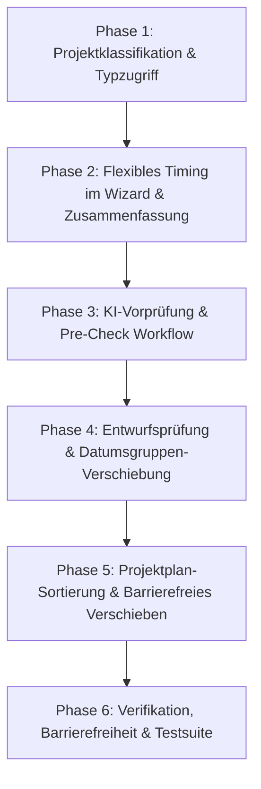

# Phasenplan: Frontend-Anpassungen für lokale Backendänderungen

Dieser Implementierungsplan beschreibt die schrittweise Anpassung des Thymeleaf-/JavaScript-Frontends an die Backend-Änderungen (`feat(plan)`, `refactor`, `feat(ai)`, `feat(wizard)`). Die Umsetzung baut strikt auf dem etablierten ProjectFlow-Designsystem auf und vermeidet Regressionsfehler durch klare Schnittstellendefinitionen und Validierungsprüfungen.

---

## Übersicht der 6 Phasen



---

## Phase 1: Projektklassifikation (`refactor`)

### Ziel
Sicherstellen, dass Thymeleaf ohne Laufzeitfehler auf die verschobene Enum-Klasse `ProjectSubCategory` zugreift.

### Betroffene Dateien
- `src/main/resources/templates/fragments/project-classification.html`

### Aufgaben & Instruktionen
1. **Paketpfad im Thymeleaf-Template aktualisieren**:
   - In Zeile 35 den Typ-Ausdruck von:
     ```html
     ${T(de.melinadanhier.projectflow.plancontainer.project.model.ProjectSubCategory).values()}
     ```
     auf den neuen Pfad umstellen:
     ```html
     ${T(de.melinadanhier.projectflow.plancontainer.project.model.classification.ProjectSubCategory).values()}
     ```
2. **Abwärtskompatibilität prüfen**:
   - Sicherstellen, dass das Fragment `project-classification :: fields` sowohl im Erstellungsassistenten (`wizard/basics.html`) als auch in der Bearbeitungsansicht (`projects/edit.html`) ohne Thymeleaf-Ausnahme gerendert wird.

---

## Phase 2: Flexibles Projekt-Timing im Wizard (`feat(wizard)`)

### Ziel
Entkopplung von Startdatum, Enddatum, Dauer und Arbeitszeit. Entfernen des starren `timeFrameType`-Modus.

### Betroffene Dateien
- `src/main/resources/templates/wizard/basics.html`
- `src/main/resources/templates/generation/ai-details.html`
- `src/main/resources/templates/generation/ai-summary.html`
- `src/main/resources/static/css/app.css`

### Aufgaben & Instruktionen
1. **`wizard/basics.html`**:
   - Radio-Gruppe `timeFrameType` und deren `<fieldset>` sowie Fehlerblock restlos entfernen.
   - Das inline `<script>` entfernen, welches Felder (`start-date-field`, `end-date-field`, `duration-field`) abhängig von Radio-Buttons ein-/ausblendet (`hidden`, `disabled`, `required`).
   - Alle 4 Zeitfelder unabhängig voneinander und standardmäßig optional anbieten:
     - `startDate` (Datum): Label „Wann möchtest du beginnen?“
     - `endDate` (Datum): Label „Gibt es einen gewünschten oder festen Endtermin?“
     - `durationDays` (Zahl, `min="1"`, `step="1"`): Label „Wie lange möchtest du ungefähr an dem Projekt arbeiten?“
     - `availableWorkingTime` (Freitext, `maxlength="1000"`, Textarea oder Input): Label „Wie viel Zeit kannst du ungefähr für das Projekt einplanen?“
   - Erklärungstext hinzufügen: „Trage nur die Angaben ein, die dir bereits bekannt sind. Alle Angaben sind optional.“
   - Spezifische Validierungsfehler direkt am jeweiligen Feld anzeigen (`th:if="${#fields.hasErrors('...')}"`).
   - Designsystem-Aktionsleiste beibehalten: „Assistent abbrechen“ (Ghost/Grau) links, „Weiter zum nächsten Schritt →“ (Primary) rechts.

2. **`generation/ai-details.html`**:
   - Neues optionales Feld `additionalInformation` ergänzen:
     - `<textarea id="additionalInformation" class="pf-textarea" th:field="*{additionalInformation}" maxlength="2000" placeholder="z. B. Besondere Prioritäten, bestimmte Tools oder zeitliche Einschränkungen..."></textarea>`
     - Feld-Label: „Zusätzliche Wünsche oder Einschränkungen“ mit `span.pf-hint (optional)`.
     - Validierungsfehlerblock für `additionalInformation` anbringen.

3. **`generation/ai-summary.html`**:
   - Definition List (`<dl>`) für Zeitangaben anpassen, sodass keine gekoppelten Annahmen getroffen werden:
     - Wenn alle 4 Felder leer sind: „Noch nicht festgelegt“.
     - Nur Startdatum vorhanden: „Startdatum: dd.MM.yyyy“.
     - Nur Enddatum vorhanden: „Endtermin: dd.MM.yyyy“.
     - Start- und Enddatum vorhanden: „Zeitraum: dd.MM.yyyy bis dd.MM.yyyy“.
     - `durationDays` separat ausweisen: „Gewünschte Dauer: X Tage“.
     - `availableWorkingTime` separat ausweisen: „Verfügbare Arbeitszeit: ...“.
   - `additionalInformation` im Bereich „Zusätzliche Angaben für die KI“ anzeigen, falls ausgefüllt.

---

## Phase 3: KI-Vorprüfung & Pre-Check Workflow (`feat(ai)`)

### Ziel
Umstellung der Pre-Check-Ansicht auf den neuen Datenvertrag (`review.problems`), Ermöglichung direkter Bestätigungen und individueller Kontextangaben, sowie Entfernung der nachgelagerten Annahmenprüfung.

### Betroffene Dateien
- `src/main/resources/templates/generation/ai-problems.html`
- Bereinigung von Links/Includes auf:
  - `src/main/resources/templates/generation/assumption-review.html`
  - `src/main/resources/static/js/assumption-review.js`

### Aufgaben & Instruktionen
1. **Entfernung der alten Annahmenprüfung**:
   - Sicherstellen, dass nach der Generierung direkt der Planentwurf (`draft-review.html`) angesteuert wird.
   - Alte Endpunkte `/projects/new/ai/assumptions/...` aus Templates entfernen.
2. **Neuer Pre-Check-Vertrag in `ai-problems.html`**:
   - Header und Titel dynamisch anpassen:
     - Wenn `review.canGenerate()`: Seitentitel „Angaben sind bereit“, Badge „Bereit“, Hauptüberschrift „Projektangaben sind bereit zur Generierung“.
     - Wenn `!review.canGenerate()`: Seitentitel „Hinweise & offene Punkte prüfen“, Badge „Prüfung erforderlich“, Hauptüberschrift „Bitte prüfe offene Punkte“.
   - Fehler-Alerts über der Liste:
     - `review.hasErrors()`: Blockierender roter Alert („Schwerwiegende Widersprüche blockieren die Plangenerierung. Bitte Eingaben anpassen.“).
     - `review.hasOpenPoints()`: Gelber Status-Alert („Offene Planungsgrundlagen müssen geprüft oder bestätigt werden.“).
   - Iteration über `review.problems` mit Bedingung `th:unless="${problem.accepted}"`:
     - **Fehler** (`problem.severity.name() == 'ERROR'`):
       - `problem.message` und `problem.suggestedUserAction` darstellen.
       - Hinweis ausgeben: „Dieser Fehler muss in den Eingaben korrigiert werden.“
       - Keine Bestätigungsaktionen rendern.
     - **Offene Punkte** (`problem.openPoint`):
       - `problem.message` als offene Frage darstellen.
       - `problem.suggestedUserAction` als Lösungsvorschlag anzeigen.
       - `problem.acceptedInterpretation` hervorheben (was bedeutet die direkte Bestätigung?).
       - **Aktion A (Direkt akzeptieren)**:
         - Formular: POST an `/projects/new/ai/problems/{workflowId}/open-points/{problemIndex}/accept`
         - Button: `pf-btn pf-btn--sm pf-btn--outline` mit Text „Interpretation direkt übernehmen“.
         - CSRF-Token mitsenden.
       - **Aktion B (Eigene Planungsgrundlage ergänzen)**:
         - Formular: POST an `/projects/new/ai/problems/{workflowId}/open-points/{problemIndex}/confirm`
         - Label: Text aus `problem.reviewQuestion`
         - Pflichtfeld: `<textarea name="planningContext" class="pf-textarea" maxlength="1000" required placeholder="Beschreibe deine Planungsgrundlage..."></textarea>`
         - Button: `pf-btn pf-btn--sm pf-btn--primary` mit Text „Kontext speichern“.
         - CSRF-Token mitsenden.
   - Start der Plangenerierung:
     - Button „Planentwurf jetzt generieren →“ **ausschließlich** anzeigen, wenn `review.canGenerate()` wahr ist.
     - „Eingaben ändern“-Button bleibt immer zugänglich.

---

## Phase 4: Entwurfsprüfung mit Datumsgruppen-Verschiebung (`feat(plan)`)

### Ziel
Entfernen der manuellen Modus-Umschaltung in der Entwurfsprüfung; stattdessen strikte Datumssortierung mit Drag-and-drop innerhalb derselben Datumsgruppe.

### Betroffene Dateien
- `src/main/resources/templates/generation/draft-review.html`
- `src/main/resources/static/js/draft-review.js`
- `src/main/resources/static/css/draft-review.css`

### Aufgaben & Instruktionen
1. **`draft-review.html`**:
   - Altes Sortiermodus-Formular (`<form class="sort-mode" ...>`) komplett entfernen.
   - Statische Hinweisbox: „Aufgaben und Meilensteine werden nach Datum sortiert angezeigt. Elemente können innerhalb ihrer Datumsgruppe verschoben werden.“
   - Jedes Element mit Attribut `data-date="${element.dateIso ?: 'undated'}"` und `data-element-id`, `data-section-id` auszeichnen.
   - Bearbeitungs- und Drag-Elemente deaktivieren/verbergen, wenn `draft.status.name() == 'APPLIED'`.
2. **`draft-review.js`**:
   - Payload beim POST an `/projects/{projectId}/draft/elements/{elementId}/move` anpassen:
     - `targetSectionId`
     - `targetDate`
     - `targetPosition`
     - `lockVersion`
     - `_csrf`
   - Clientseitige Validierung: Prüfen, dass `dragged.dataset.date === target.dataset.date`. Andernfalls Drop abbrechen und visuelles Feedback geben.

---

## Phase 5: Projektplan-Sortierung & Barrierefreie Verschiebung (`feat(plan)`)

### Ziel
Vollständige Unterstützung von `DATE` und `MANUAL` im Projektplan inklusive Drag-and-drop und tastaturbedienbarer/barrierearmer Steuerung.

### Betroffene Dateien
- `src/main/resources/templates/projects/plan.html`
- `src/main/resources/static/js/plan-ordering.js` (neu)
- `src/main/resources/static/css/app.css`

### Aufgaben & Instruktionen
1. **Sortiermodus-Auswahl in `plan.html`**:
   - Umschaltung (`DATE` vs. `MANUAL`) im Kopfbereich des Projektplans anbieten, wenn `plan.editable` wahr ist:
     - Formular: POST an `/projects/{projectId}/plan/sort-mode`
     - Felder: `sortMode` (`DATE` / `MANUAL`) und `projectLockVersion` (`${plan.project.lockVersion}`)
     - CSRF-Token mitsenden.
     - Auto-Submit bei Select-Änderung oder dedizierter Button „Sortierung anwenden“.
2. **Planbereiche verschiebbar machen**:
   - Bei `plan.editable`: Drag-Handle + Tastaturknöpfe (Hoch/Runter) an jedem Bereich.
   - POST an `/projects/{projectId}/plan/sections/{sectionId}/move` mit:
     - `targetPosition`
     - `projectLockVersion`
     - CSRF-Token.
3. **Aufgaben und Meilensteine verschiebbar machen**:
   - Jedes Element erhält Drag-Handle und barrierefreie Knöpfe („Nach oben / Nach unten / In Bereich verschieben“).
   - POST an `/projects/{projectId}/plan/elements/{elementId}/move` mit:
     - `targetSectionId`
     - `targetDate` (ISO-Datum oder leer)
     - `targetPosition`
     - `projectLockVersion`
     - CSRF-Token.
4. **Sortierregeln**:
   - **Bei Datumssortierung (`DATE`)**: Verschieben nur innerhalb derselben Datumsgruppe erlaubt.
   - **Bei manueller Sortierung (`MANUAL`)**: Verschieben innerhalb desselben Bereichs sowie bereichsübergreifend frei möglich.
5. **Barrierearme Tastaturbedienung**:
   - Neben HTML5 Drag-and-drop erhalten interaktive Elemente ARIA-Attribute (`aria-grabbed`, `aria-dropeffect`) und Tastatur-Shortcuts oder sichtbare Move-Buttons („▲ / ▼“), damit die Bedienung ohne Maus uneingeschränkt möglich ist.

---

## Phase 6: Verifikation & Testabnahme

### Ziel
Vollständige Prüfung aller 9 Abnahmekriterien aus der Aufgabenstellung ohne Fehler oder Regressionen.

### Testplan
1. **Automatisierte Tests**:
   - Ausführung der vollständigen Testsuite:
     ```powershell
     .\mvnw.cmd test
     ```
   - Sicherstellen: `BUILD SUCCESS`, 0 Failures, 0 Errors.
2. **Manuelle & Template-Validierung**:
   - Abnahmekriterium 1: `project-classification.html` rendert ohne Thymeleaf-Fehler.
   - Abnahmekriterium 2 & 3: `ai-problems.html` zeigt Fehler blockierend und offene Punkte mit Bestätigungsoptionen; Plangenerierung nur wenn `review.canGenerate()`.
   - Abnahmekriterium 4 & 5: Beliebige optionale Kombinationen aus Start, Ende, Dauer und Arbeitszeit werden im Wizard akzeptiert und in `ai-summary.html` exakt dargestellt.
   - Abnahmekriterium 6: Sortieren und Verschieben im Projektplan und in der Entwurfsprüfung funktionieren regelkonform (Datumsgruppen-Restriktion).
   - Abnahmekriterium 7: Alle POST-Anfragen transportieren CSRF und die jeweilige Lock-Version.
   - Abnahmekriterium 8: Schreibgeschützte und übernommene Pläne zeigen keine aktiven Verschiebe-Elemente.
   - Abnahmekriterium 9: Responsives Layout und barrierearme Tastaturbedienung sind gewährleistet.
